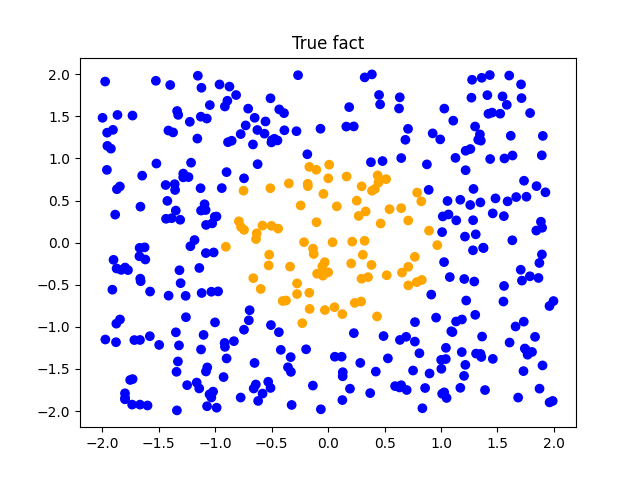
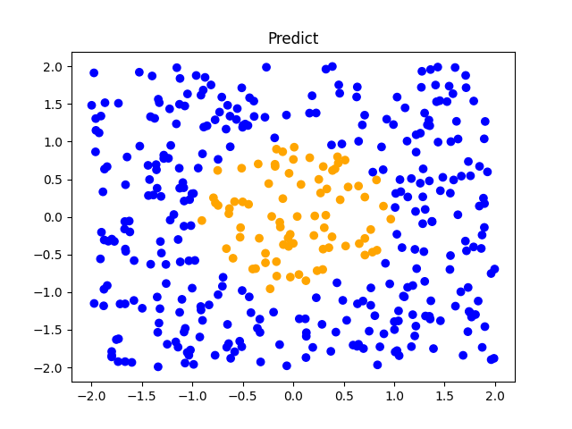

# A-simple-dnn-with-numpy
This demo aims to classify whether a dot in a unit circle or not with a multi-layer dnn completely inplemented by numpy(without any deep learning frameworks)

<div style="display:flex; align-items:center;">


</div>

## Getting Started
### Dependencies and requirements
```
pip install numpy, matplotlib
```

### Usage
```
python run.py
```

### Results
Pictures of original data and predicted results.

